## Configuración por defecto

- **IP**: 192.168.1.20
- **Usuario**: ubnt
- **Contraseña**: ubnt

---

**IMPORTANTE: **

- En cada pestaña se deben aplicar los cambios

---

## [[AP]] Punto de acceso. Paso a paso

1. LOGIN

   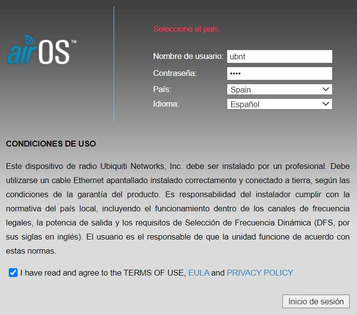

2. SYSTEM

   - Actualizar el Firmware

     Seleccionar archivo > cargar > actualizar (IMPORTANTE: No apagar/reiniciar el equipo durante la actualización)

     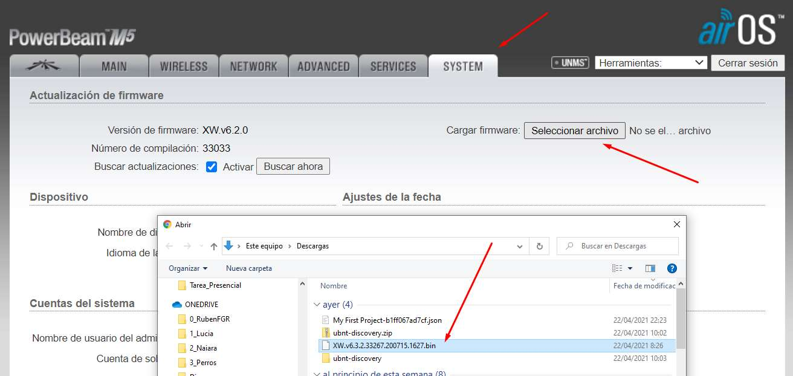

     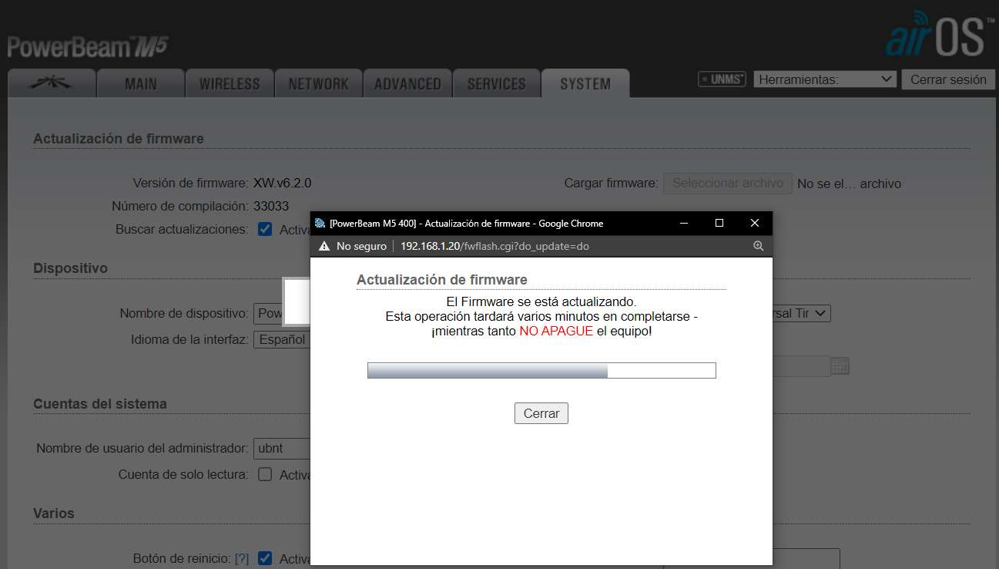

   - Cambiar los datos del usuario, fecha, hora y más...

   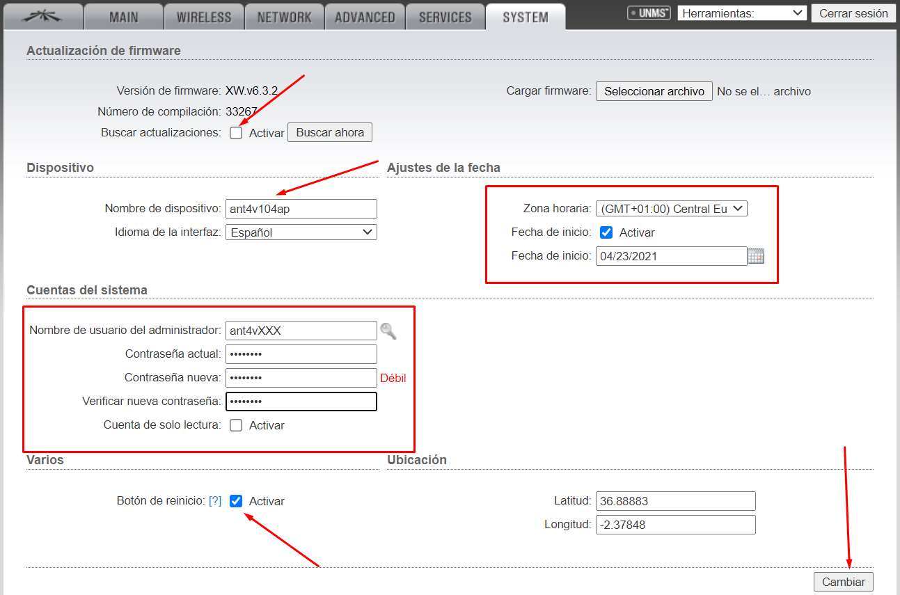

3. WIRELESS

   Desactivar el cálculo del límite EIRP (límites reglamentados en potencia de salida para interiores y exteriores) y aumentar la potencia de salida a 26 dBm

   IMPORTANTE: Esta configuración es para alineación y debe ser modificada a posteriori ya que no esta en los límites soportados

   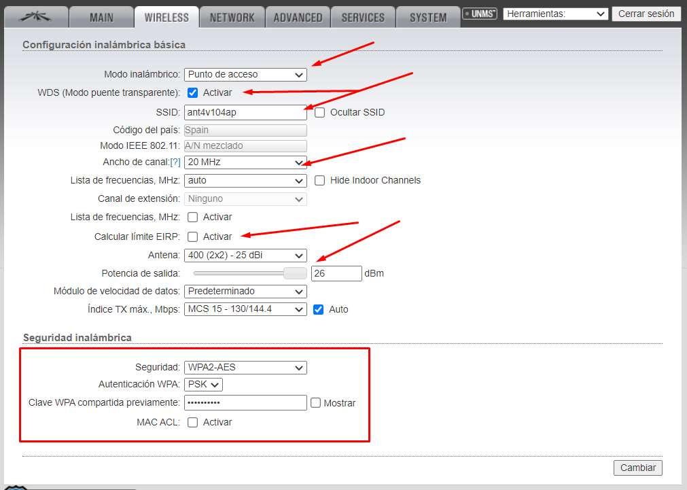

4. NETWORK

   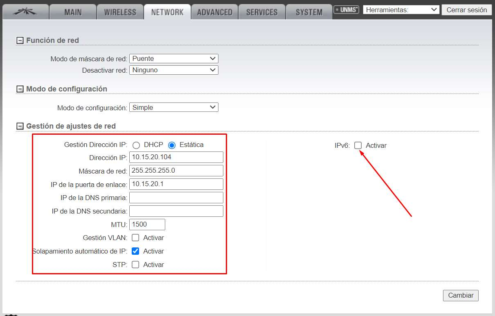

5. ADVANCED

   IMPORTANTE: Quizás sea necesario realizar dos cambios y aplicar para aumentar la distancia hasta 32.5 millas

   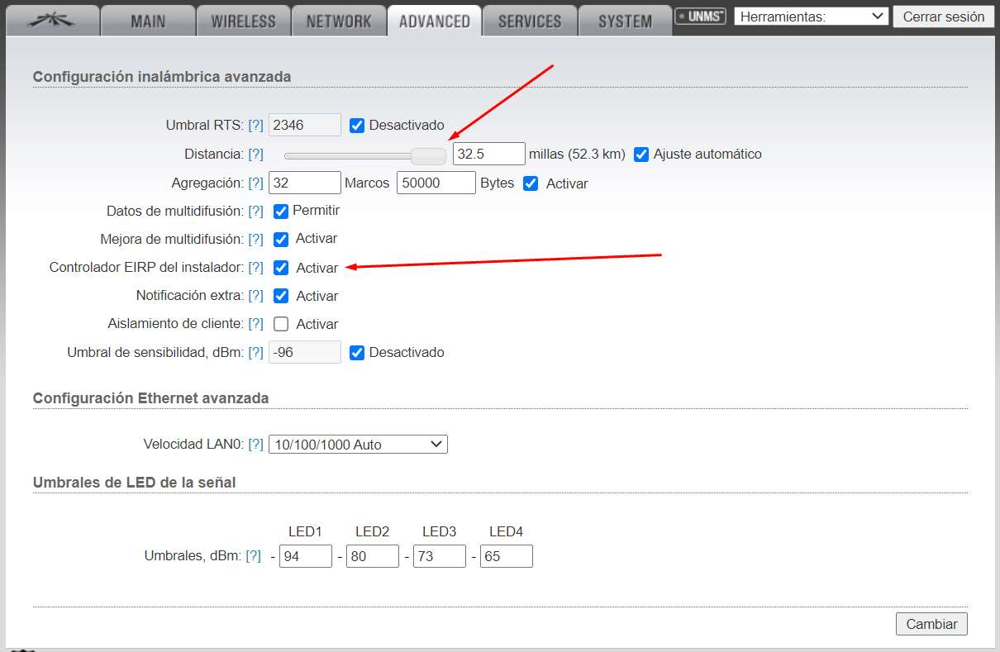

6. SERVICES

   Deshabilitar SSH (evitar conexión por terminal remoto) y CDP (evitar que otros equipos puedan ver datos de interés)

   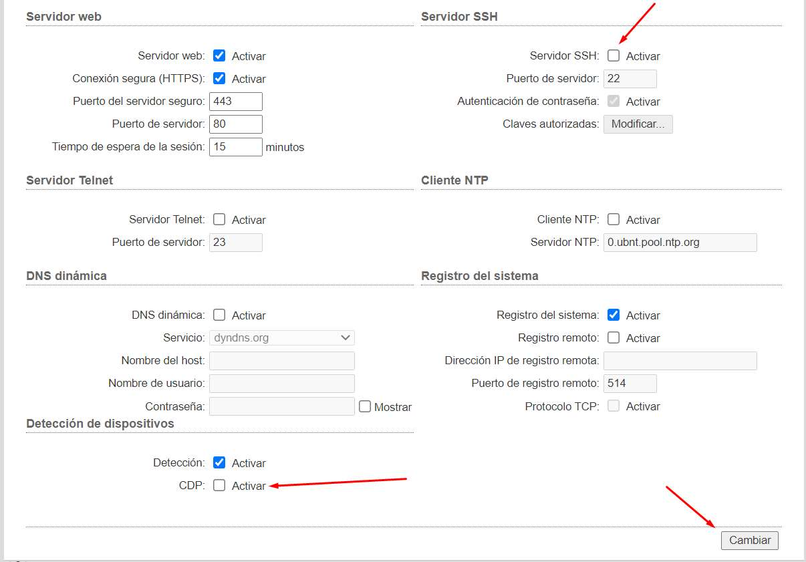

7. **Aplicar todos los cambios**
8. Utilizar la herramienta de "Encuesta del sitio" para escanear redes WiFi disponibles

## [[Station]] Estación. Paso a paso

1. LOGIN (MISMOS PASOS QUE EN AP)

2. SYSTEM

   - Actualizar el Firmware (MISMOS PASOS QUE EN AP)
   - Cambiar datos de usuario, fecha, coordenadas, etc...

   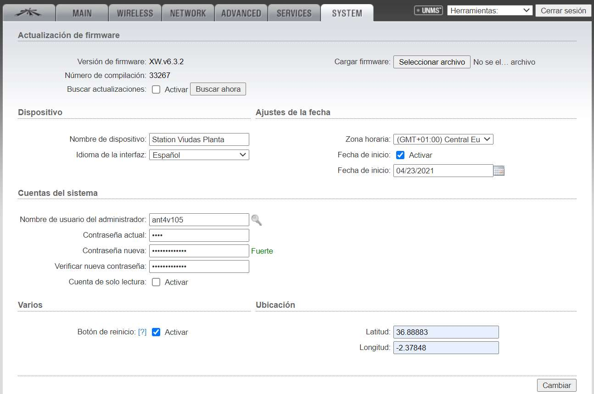

3. ADVANCED

   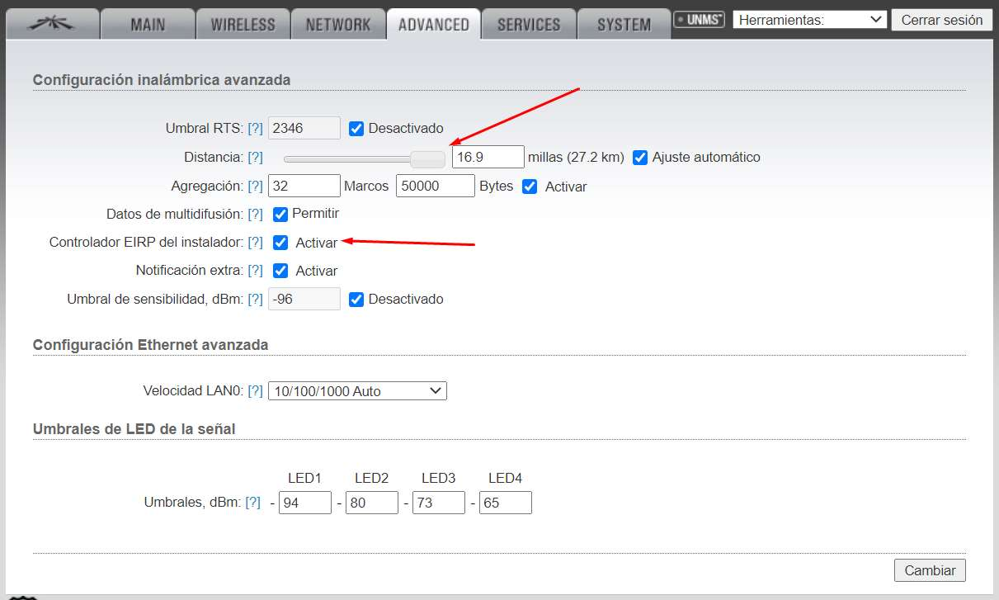

4. SERVICES

   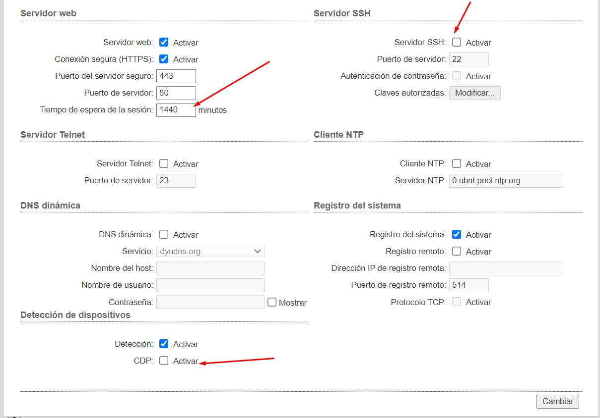

   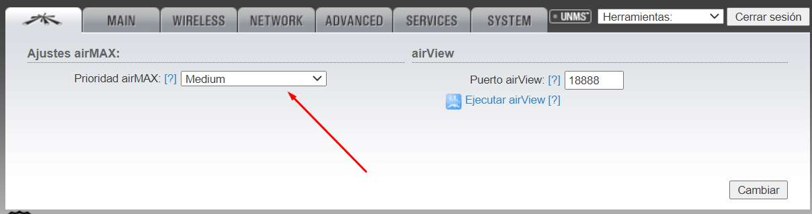

5. NESTWORK

   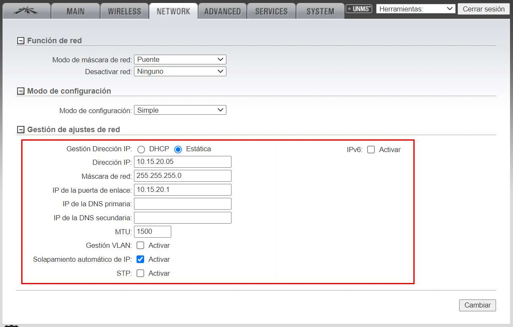

6. WIRELESS

   - Seleccionar el modo inalámbrico "Estación" y seleccionar la otra antena por su SSID (debe estar encendida)

   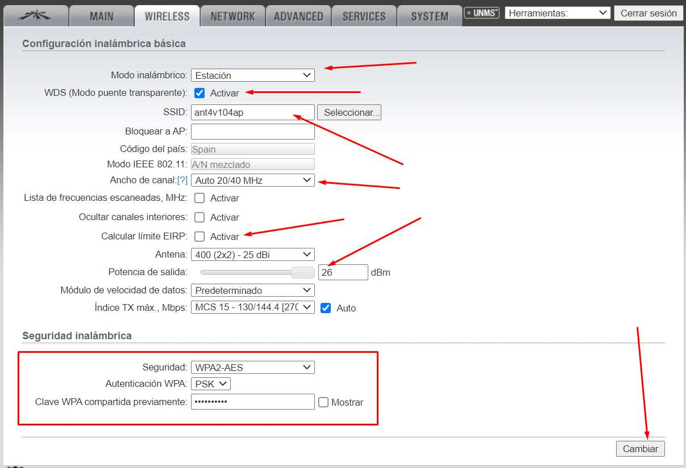

   **IMPORTANTE:** Una vez que se enlazan será necesario desconectar una de las antenas del switch ya que se puede acceder desde la otra y en caso de no hacerlo existe conflicto de IPs

## [[Afinar la señal]]

**Jugar con los canales DFS exteriores (En españa se permiten hasta 30 dBm de potencia de señal)**

